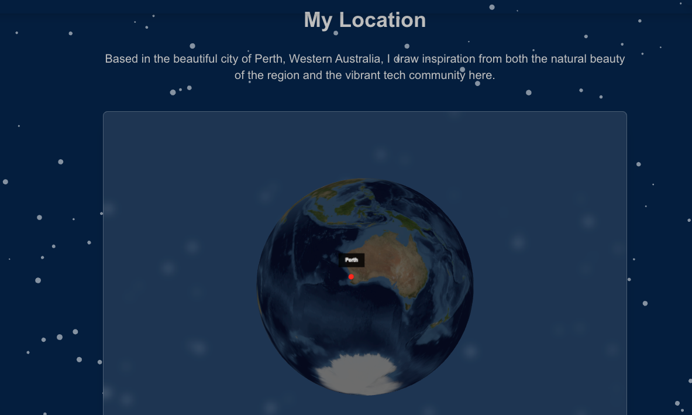
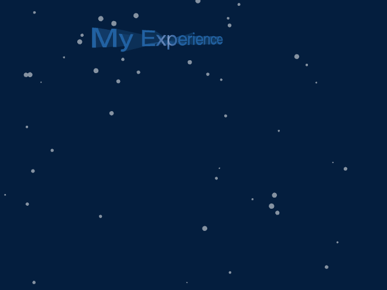
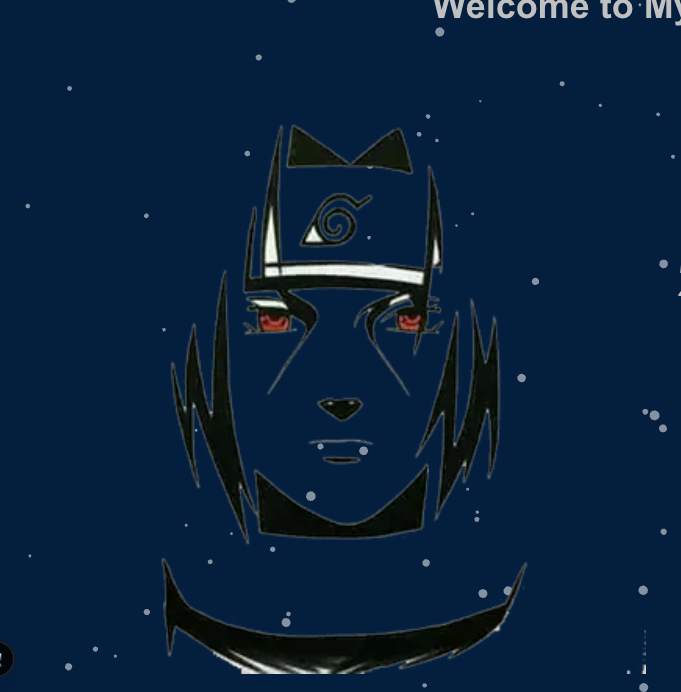
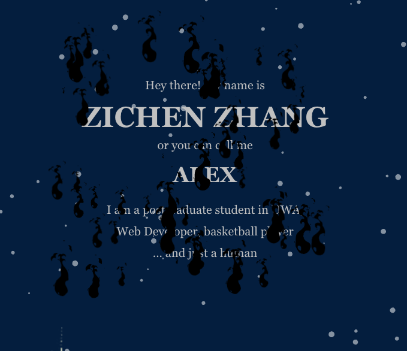
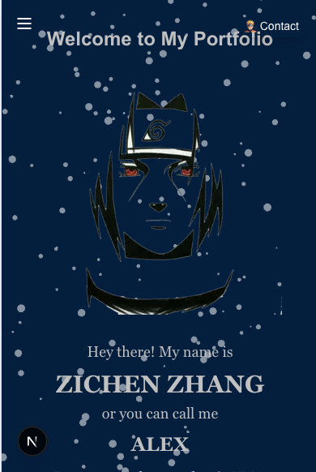

# Immortal_dragons

## React + Three.js + WebGL 个人作品集应用

## 技术实现

### 核心技术

- **Next.js**: 用于服务端渲染 React 应用的框架
- **Three.js**: 简化 WebGL 使用的 JavaScript 3D 库
- **React**: 用于构建用户界面的 JavaScript 库
- **WebGL**: 用于渲染交互式 2D 和 3D 图形的 Web 图形库

### 关键组件

#### 1. 交互式 3D 地球仪

应用程序使用 Three.js 渲染的完全交互式 3D 地球仪。包括逼真的纹理、光照效果和自定义位置标记。

```javascript
// EarthGlobe.js实现亮点
// - 使用THREE.SphereGeometry作为地球基础
// - 应用带凹凸贴图的逼真纹理
// - 自定义位置标记及标签
// - 用户可通过OrbitControls进行交互操作
```



<!-- Screenshot placeholder - Earth Globe component -->

#### 2. 3D 文本渲染

使用 Three.js TextGeometry 创建的自定义 3D 文本元素，具有动态光照、动画效果和响应式尺寸。

```javascript
// Text3D.js实现亮点
// - 使用FontLoader和TextGeometry创建3D文本
// - 带高光的Phong材质
// - 基于正弦波的平滑动画
// - 针对不同设备尺寸的响应式设计
```



<!-- Screenshot placeholder - 3D Text component -->

#### 3. 交互式 Canvas 背景

响应用户鼠标移动的动态 Canvas 粒子效果背景。

```javascript
// canvasbg.js实现亮点
// - 使用HTML5 Canvas高效渲染粒子
// - 基于物理的鼠标交互
// - 响应视口变化
// - 使用requestAnimationFrame优化性能
```



<!-- Screenshot placeholder - Canvas background -->

#### 4. 动画效果

应用程序中实现的各种动画效果：

- 视差滚动效果
- 燃烧文字效果
- 3D 对象动画
- 交互式 UI 元素



<!-- Screenshot placeholder - Animation effects -->

### 响应式设计

应用程序完全响应式，针对以下设备进行了特定优化：

- 移动设备（减少几何复杂度，调整摄像机位置）
- 平板电脑
- 桌面浏览器



### 性能优化

- 重型组件的动态导入
- Canvas 优化技术
- 组件卸载时 Three.js 场景清理
- 事件监听器管理

## 开始使用

首先，运行开发服务器：

```bash
npm run dev
# 或
yarn dev
# 或
pnpm dev
# 或
bun dev
```

使用浏览器打开 [http://localhost:3000](http://localhost:3000) 查看结果。

## 部署在 Vercel 上

https://immortal-dragons.vercel.app/
